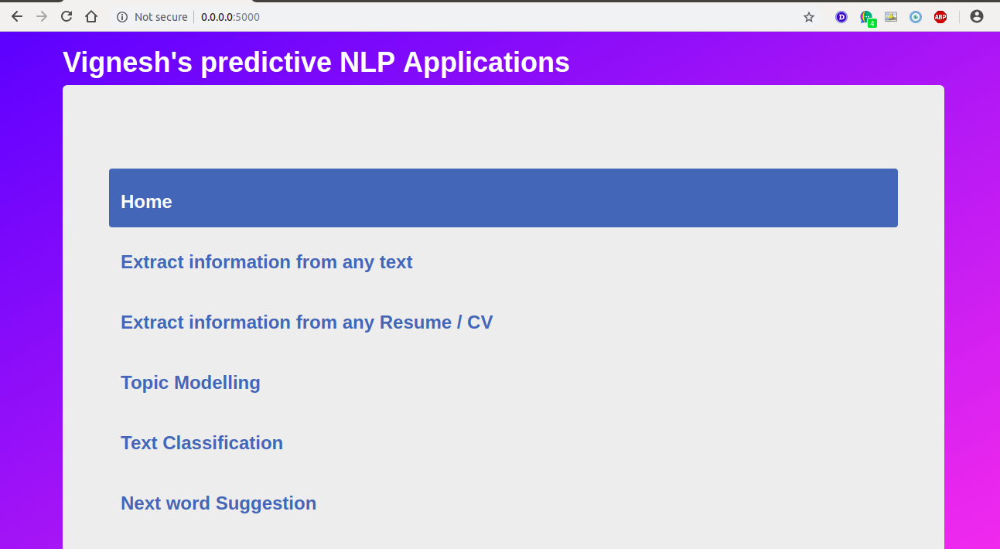
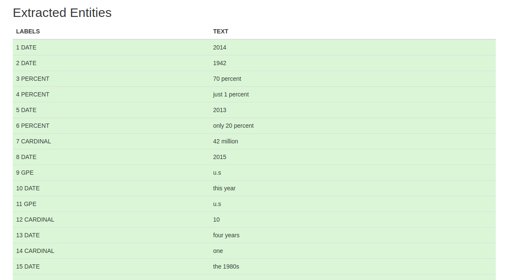
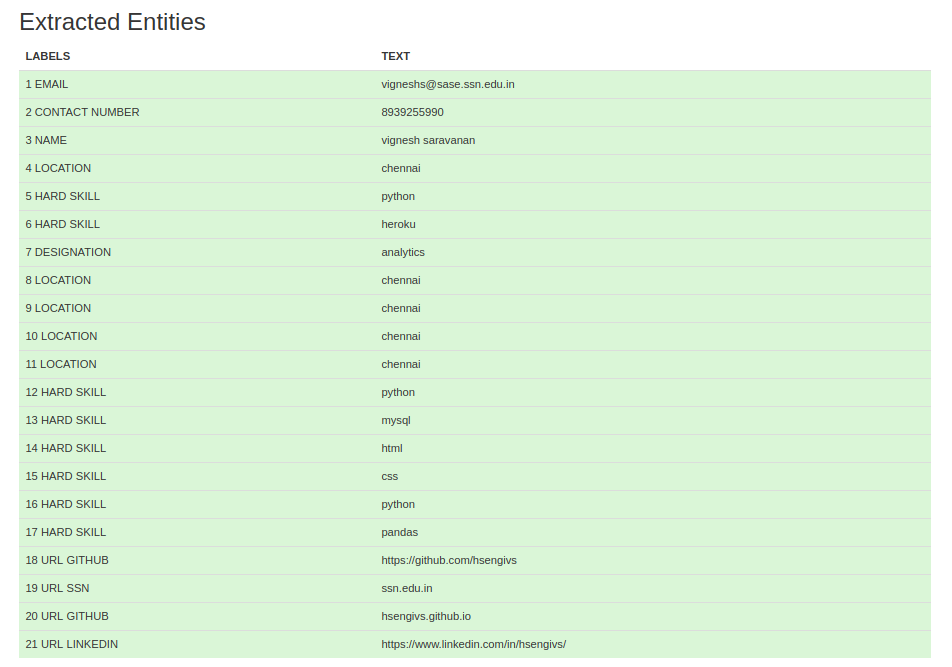
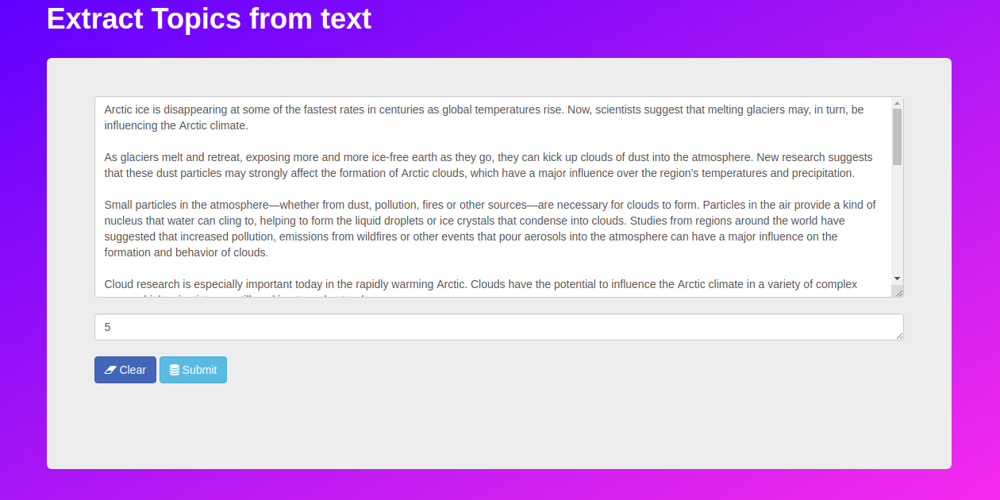
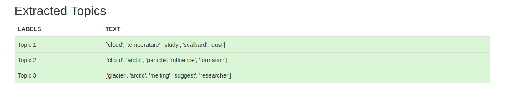
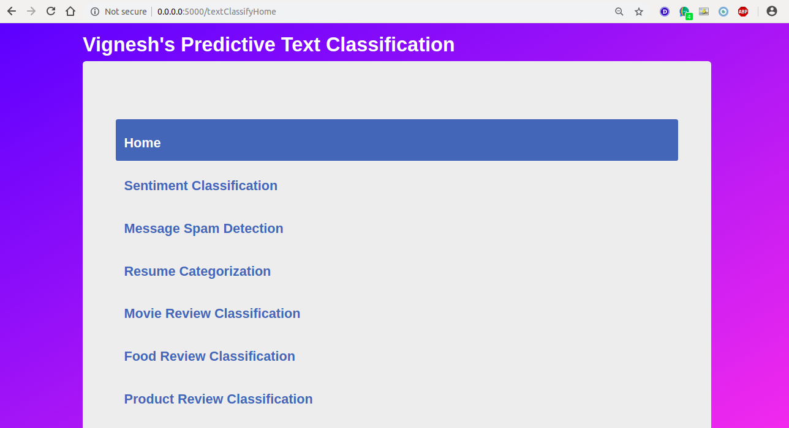

# Predictive Web Software
A simple predictive NLP web service using Python Flask, Spacy and Gensim

The services provided are as follows,

* Named Entity Recognition (NER) from any text
* Information retrieval from resume
* Extract topics from a given text
* Next word prediction
* Text Category Prediction (**On progress**)
    * Predicting the sentiments as either positive, negative or neutral
    * Predict whether a message is spam or not
    * Resume Categorization
    * Classify Movie reviews
    * Classify Food and Product reviews

# Installation

1. Clone the repository

        git clone https://github.com/HsengivS/Predictive-Application.git

        cd Predictive Application/

2. Set python virtual environment

        python3 -m venv env

        source ./env/bin/ctivate

3. Install the dependencies

        pip install requirements.txt

4. For NLP task I have used spacy model en_core_web_sm. Install them using:

        python -m spacy download en_core_web_sm

        python -m nltk nltk.download('words')

5. Run the python file

        python app.py

6. Open the browser enter 0.0.0.0:5000

# Working:

1. when 0.0.0.0:5000 (or) 0.0.0.0:5000/ endpoint is entered in browser, the following is displayed

2. Extract information from any text

3. Extracted Entities from text

4. Extract entiies or information from resume, for this I have used custom model named resume_model, which was manually annotated from 300 resumes. Now Copy paste any resume text in the text area and click submit button to see the extracted entities. Entity named Url, email, contact number were extracted using tldextract and regular expressions

5. Extracted entities

6. Extract Topics from text by entering the text and the number of topics

7. Result

8. Text Categorization (**work is on progress**)

# Stay tunned  for the update ...

# References that helped me get here

- https://spacy.io/usage/linguistic-features#named-entities](https://spacy.io/usage/linguistic-features#named-entities)

- [https://www.analyticsvidhya.com/blog/2017/04/natural-language-processing-made-easy-using-spacy-%E2%80%8Bin-python/](https://www.analyticsvidhya.com/blog/2017/04/natural-language-processing-made-easy-using-spacy-%E2%80%8Bin-python/)

- [https://towardsdatascience.com/building-a-flask-api-to-automatically-extract-named-entities-using-spacy-2fd3f54ebbc6](https://towardsdatascience.com/building-a-flask-api-to-automatically-extract-named-entities-using-spacy-2fd3f54ebbc6)

- [https://radimrehurek.com/gensim/](https://radimrehurek.com/gensim/)

### Built with ♥ and :coffee: by [`Vignesh Saravanan`](https://hsengivs.github.io/)
